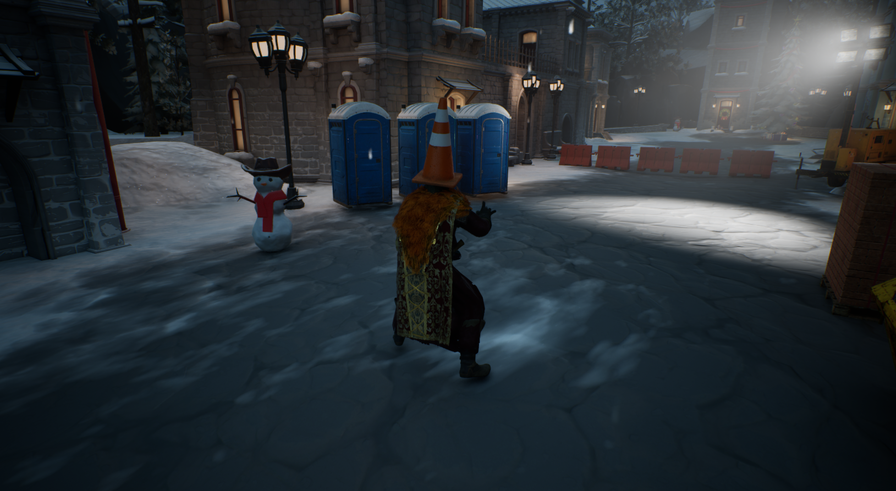
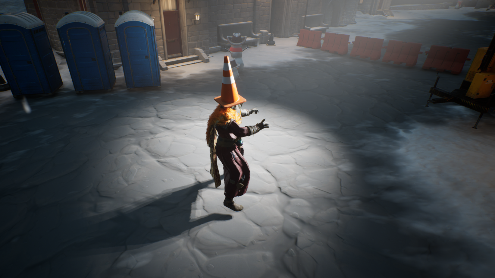
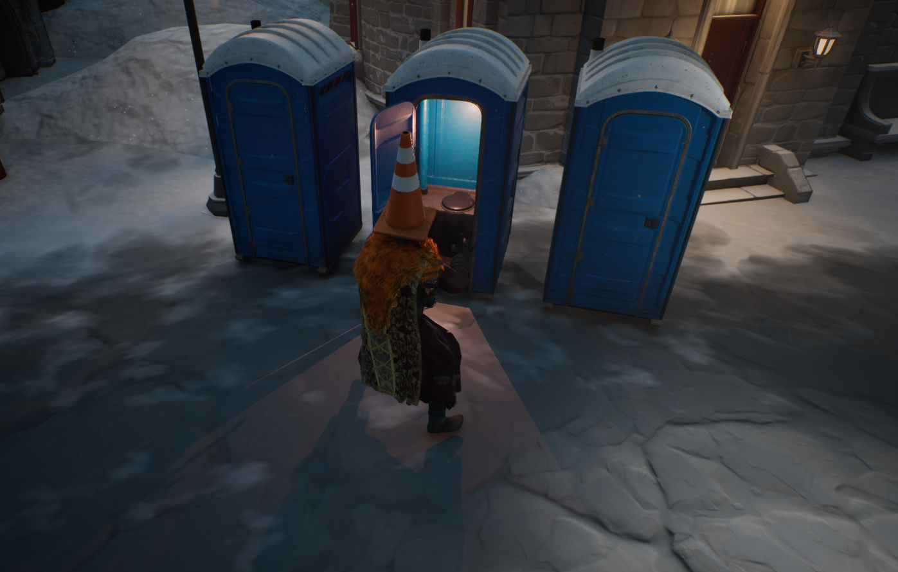

# Third Person Perspective Game

## Description
This project is a Third Person Perspective game developed in Unreal Engine. The main goal of this project is to serve as a learning and experimentation platform for various aspects of game development, including character movement, animations, lighting, and artificial intelligence (AI).

## Features
- Third person perspective gameplay.
- Player character movement mechanics experimentation.
- Implementation of various animations for character actions.
- Lighting setup and experimentation for different moods and atmospheres.
- Introduction and testing of AI for non-player characters (NPCs) or enemies.
- Opportunity to explore Unreal Engine's capabilities for game development.

## Disclaimer
This project is developed for educational and experimental purposes only. It may contain incomplete features, bugs, or unfinished components. Use it at your own discretion.
